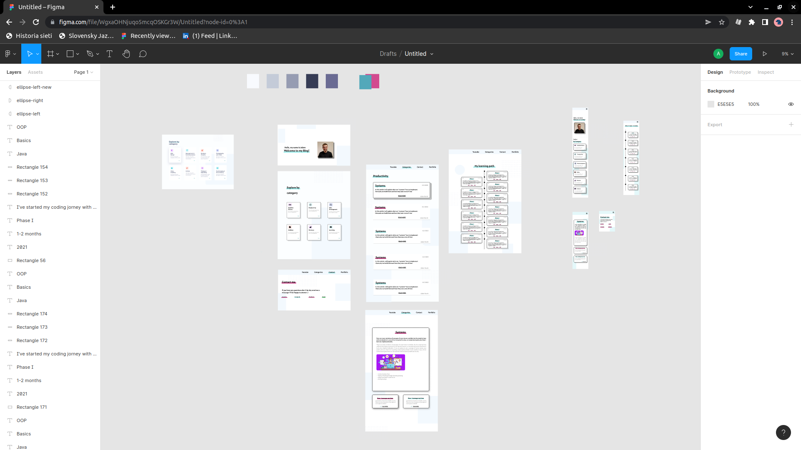
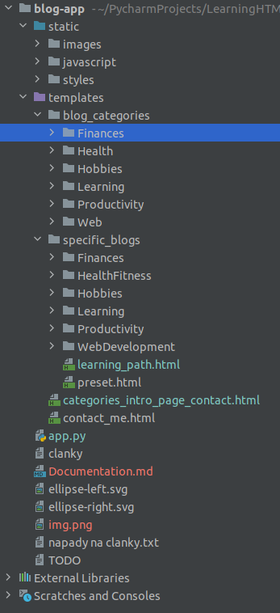

# Blog app

## Goal of this project :

*Goal of this project was to build a blog website to describe my personality and show my coding journey.*

## Technologie that i used : 
- **Programming languages** – JavaScript, HTML5, CSS, Python
- **Frameworks & libraries** – Flask
- **Technologies** – Flask server, SCSS
- **Programs & tools** – Figma, Photoshop, Git, Github, Pycharm IDE 

## Workflow :

<strong>These are the steps that I followed to build this project:</strong>

<h2>1. **Firstly I designed the website in Figma**</h2>

<h2>2. **After that I've created code structure for the project**</h2>
 

<h2>3. **Coded and styled the website**</h2>

## What I’ve learned :

- SCSS file Nesting
- Working with media query's and responsive design
- CSS Grid
- Figma
- CSS keyframes
- CSS animations
- Better understandment of CSS position property

## How to start : 

1. **Get the project from Github** 
2. **Run app.py**

